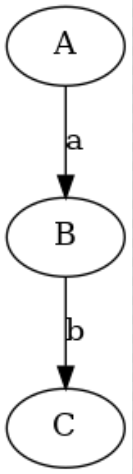

# Regex2DFA

## McMaughton-Yamada-Thompson 算法

> McMaughton-Yamada-Thompson 算法可以将任何正则表达式转变为接受相同语言的 NFA 

### 基本规则

1. 对于表达式 `ε`，构造下面的 NFA： 
   

2. 对于非 `ε`，构造下面的 NFA： 
   

### 归纳规则
假设正则表达式 s 和 t 的 NFA 分别为 `N(s)` 和 `N(t)`，那么对于一个新的正则表达式 r，则如下构造 `N(r)`：

1. 并
当 `r = s|t`，`N(r)` 为


2. 连接
当 `r = st`，`N(r)` 为


3. 闭包
当 `r = s*`，`N(r)` 为


## 1. 添加连接符


## 2. 中缀转后缀

1. 如果遇到字母，将其输出。
2. 如果遇到左括号，将其入栈。
3. 如果遇到右括号，将栈元素弹出并输出直到遇到左括号为止。左括号只弹出不输出。
4. 如果遇到限定符，依次弹出栈顶优先级大于或等于该限定符的限定符，然后将其入栈。
5. 如果读到了输入的末尾，则将栈中所有元素依次弹出。

 优先级从小到大分别为 

- 连接符 `@`
- 闭包 `*`
- 并 `|` `+`

## 3. 后缀表达式构建NFA

1. 如果为字母 s，构建基本 NFA `N(s)`，并将其入栈
2. 如果为 `|`，弹出栈内两个元素 `N(s)`、`N(t)`，构建 `N(r)` 将其入栈（`r = s|t`）
3. 如果为 `·`，弹出栈内两个元素 `N(s)`、`N(t)`，构建 `N(r)` 将其入栈（`r = st`）
4. 如果为 `*`，弹出栈内一个元素 `N(s)`，构建 `N(r)` 将其入栈（`r = s*`）

## 子集构造法(Subset construction)

用字符来描述状态的改变其实效率是很低的，试想一下UTF-8的字符集有多大？如果只使用字符来描述状态的改变生成的DFA是很大的，所以可以利用字符集来描述状态的改变，当利用这样的边时，在匹配字符上就可以利用BST了，并且在建立DFA时也省事许多，拥有更高的效率，可以这样做 

# 结果

## `ab`



```
Regex :ab
a@b$
ab@$
start: 0
end: 3
0
 ===a===>      1 
1
 ===epsilon===>      2 
2
 ===b===>      3 
3
  ['a', 'b']
{0} [{1, 2}, set()]
{1, 2} [set(), {3}]
{3} [set(), set()]
[{0}, {1, 2}, {3}]
  ['a', 'b']
A ['B', ' ']
B [' ', 'C']
C [' ', ' ']
['A', 'B', 'C']
```


## `(0*10*1)*0*`


```
Regex :(0*10*1)*0*
(0*@1@0*@1)*@0*$
0*10*1@@@*0*@$
start: 12
end: 17
0
 ===0===>      1 
1
 ===epsilon===>      0       3 
2
 ===epsilon===>      0       3 
3
 ===epsilon===>      4 
4
 ===1===>      5 
5
 ===epsilon===>      8 
6
 ===0===>      7 
7
 ===epsilon===>      6       9 
8
 ===epsilon===>      6       9 
9
 ===epsilon===>      10 
10
 ===1===>      11 
11
 ===epsilon===>      2       13 
12
 ===epsilon===>      2       13 
13
 ===epsilon===>      16 
14
 ===0===>      15 
15
 ===epsilon===>      14       17 
16
 ===epsilon===>      14       17 
17
  ['0', '1']
{0, 2, 3, 4, 12, 13, 14, 16, 17} [{0, 1, 17, 3, 4, 14, 15}, {5, 6, 8, 9, 10}]
{0, 1, 17, 3, 4, 14, 15} [{0, 1, 17, 3, 4, 14, 15}, {5, 6, 8, 9, 10}]
{5, 6, 8, 9, 10} [{9, 10, 6, 7}, {0, 2, 3, 4, 11, 13, 14, 16, 17}]
{9, 10, 6, 7} [{9, 10, 6, 7}, {0, 2, 3, 4, 11, 13, 14, 16, 17}]
{0, 2, 3, 4, 11, 13, 14, 16, 17} [{0, 1, 17, 3, 4, 14, 15}, {5, 6, 8, 9, 10}]
[{0, 2, 3, 4, 12, 13, 14, 16, 17}, {0, 1, 17, 3, 4, 14, 15}, {5, 6, 8, 9, 10}, {9, 10, 6, 7}, {0, 2, 3, 4, 11, 13, 14, 16, 17}]
  ['0', '1']
A ['A', 'B']
B ['B', 'A']
['A', 'B']
```

